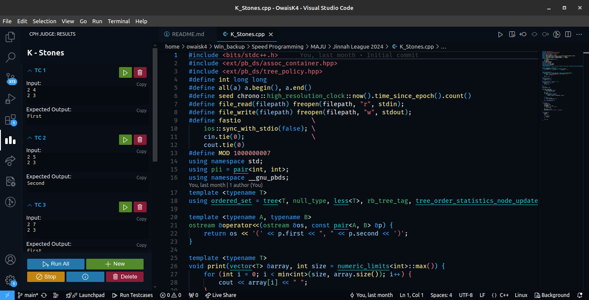

# Hey 👋, I'm Owais Ali Khan
<!--  -->

## 💫 About Me:
I’m currently an undergraduate student at <a href="https://khi.nu.edu.pk/" > FAST NUCES, Karachi</a> and an avid competitive programmer, and linux geek. With a lifelong obsession with computers and programming, my interests mainly focus on the bare metal stuff (data infrastructure, data engineering, and distributed systems). 
I enjoy reading visual novels in my spare time.  
Check out:

## 🌐 Socials:

<!-- <h2>✒️ Recent Posts</h2>

    
Explore

    <li><a target="_blank" href="https://medium.com/coinmonks/how-to-work-with-floating-points-in-solidity-how-to-calculate-amortizing-loans-in-solidity-cacfeaaa2b49">How to use Floating Points in Solidity? || How to Calculate Amortizing Loans in Solidity? — August 20, 2022</a></li>
    <li><a target="_blank" href="https://medium.com/@wahaj.javed02/acm-cys-intra-fast-ctf-challenges-67cafeb95f81">ACM Intra-Fast Capture The Flag Competition Writeup — March 20, 2023</a></li>
    <li><a target="_blank" href="https://medium.com/@wahaj.javed02/how-to-run-deepseek-r1-locally-on-windows-10-11-213200a1295a">How to run DeepSeek-r1 Locally — January 28, 2025</a></li>

 -->

## 💻 Tech Stack:

# 📊 GitHub Stats:
 
 

<!-- Proudly created with GPRM ( https://gprm.itsvg.in ) -->
